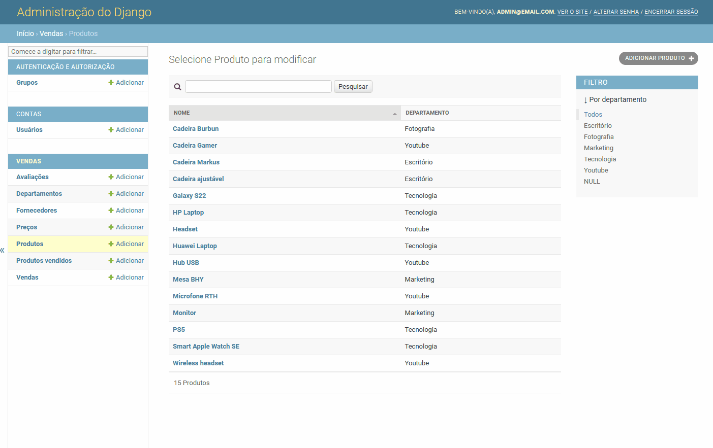
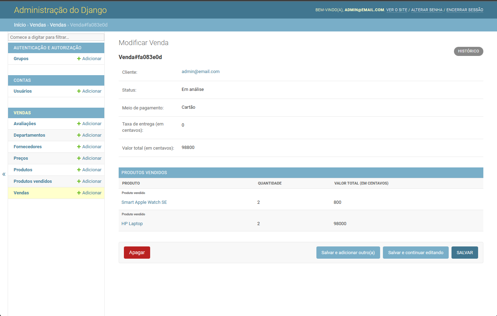
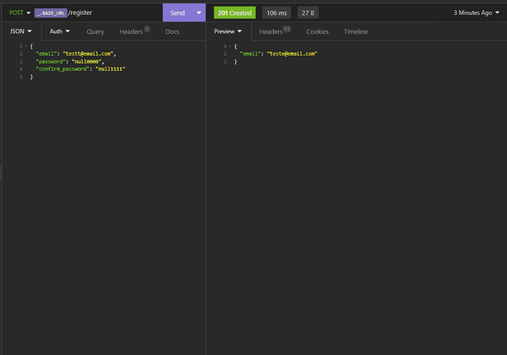
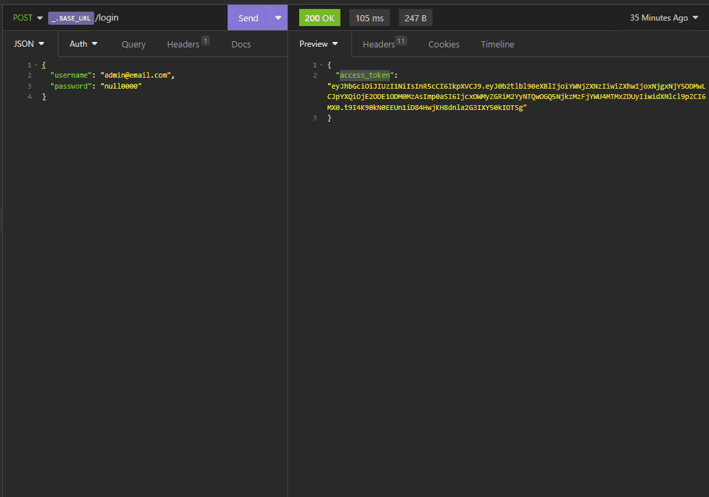
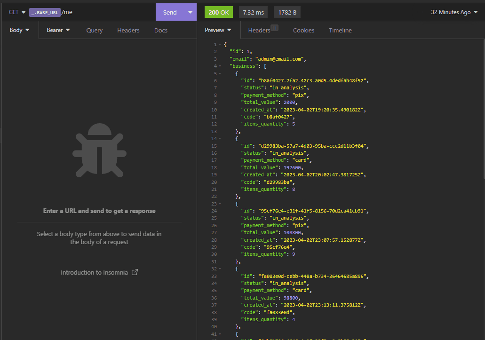
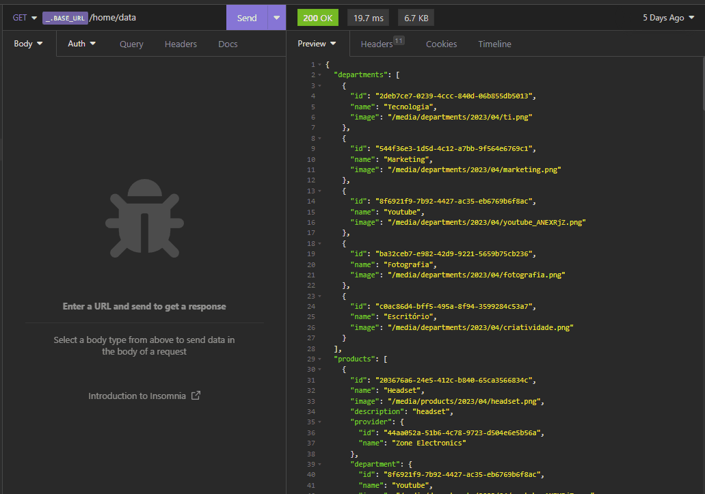
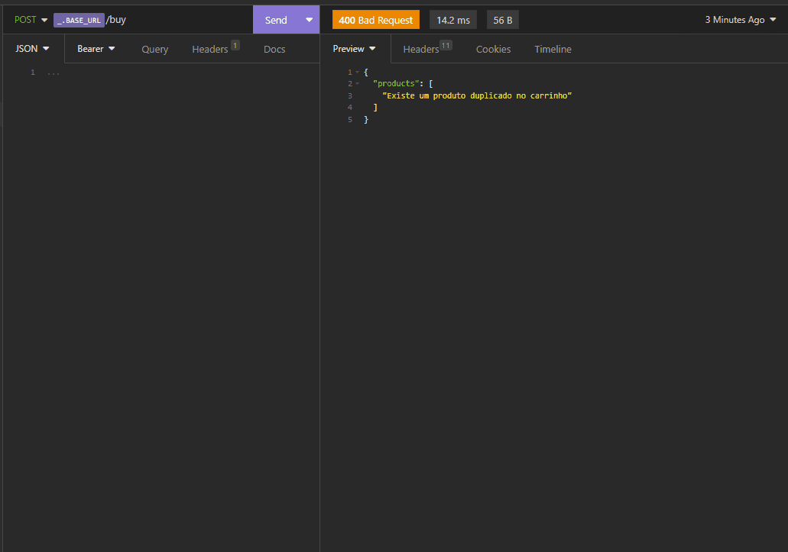
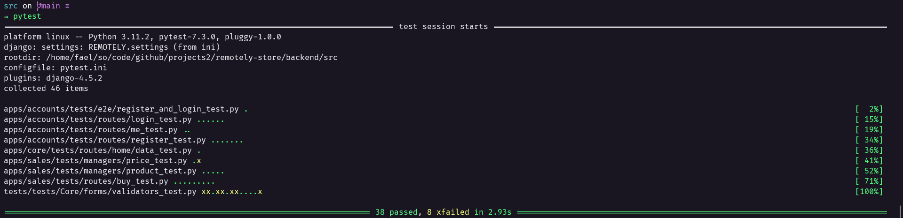

<h1>📖 Documentação Back-end</h1>

Este back-end foi desenvolvido, principalmente, com Python, Django e Django Rest Framework. O projeto está disponível no link <a href="https://api.remotely-backend.tech/">https://api.remotely-backend.tech/</a>, o deploy foi feito usando nginx e gunicorn em uma máquina virtual na Digital Ocean. Para visualizar o sistema administrativo informe viewer para usuário e null0000 para senha. <a href="./readme/remotely.json" type="application/json" download="remotely.json">Baixar o Insomnia com as rotas.</a>

 

<h2>🔗 Relacionados</h2>
<ul>
<li><a href="https://github.com/dhomini-rabelo/remotely-store">Introdução</a></li>
<li><a href="https://github.com/dhomini-rabelo/remotely-store/tree/main/frontend">Documentação Front-end</a></li>
</ul>

 
<h2>🔗 Tópicos</h2>
<ul>
<li><a href="#organization">Organização</a></li>
<li><a href="#tools">Ferramentas</a></li>
<li><a href="#db">Banco de dados</a></li>
<li><a href="#admin">Django Admin</a></li>
<li><a href="#routes">Rotas</a></li>
<li><a href="#tests">Testes</a></li>
</ul>

 
<h2 id="organization">🎯 Organização</h2>

<ul>

<li>remotely-store/backend/ - Tudo relacionado ao back-end</li>
<li>remotely-store/backend/src/ - Código do fonte do projeto Django</li>
<li>remotely-store/backend/ - Além da pasta src/, fica o disponível para ambiente virtual, documentação, testes específicos e outras coisas relacionadas ao back-end</li>
<li>remotely-store/backend/src/REMOTELY - Configurações principais do projeto</li>
<li>remotely-store/backend/src/apps - Pasta onde estão os apps Django do projeto</li>
<li>remotely-store/backend/src/Core - Recursos que serão utilizados em vários apps</li>
<li>remotely-store/backend/src/frontend - Armazenar arquivos de upload e estáticos</li>
<li>remotely-store/backend/src/tests/fixtures - Fixtures genéricas do projeto</li>
<li>remotely-store/backend/src/tests/tests - Testes de integrações e funcionalidades fora do escopo de apps</li>
<li>remotely-store/backend/src/commands - Comandos do projeto</li>
<li>remotely-store/backend/src/Fast - dependência para comandos, código mais antigo, que pretendo transformar em uma biblioteca</li>

</ul>

<h3>Sobre os apps Django do projeto</h3>

Eu utilizo apps personalizados no Django, principalmente porque prefiro separar as responsabilidades de um app. O
app padrão do Django deixa o arquivo de views.py junto a arquivos de configurações, como apps.py para o app, models
para tabelas no banco e admin.py para sistema administrativo. Como sabem, o Django é um framework opinado, porém 
ele não nos obriga a usar rotas dentro do app, podemos configurar isto no arquivo inicial de rotas (remotely-store/backend/src/REMOTELY/urls.py). Então, deixo as configurações do app numa camada mais interna
(remotely-store/backend/src/apps/{nome-do-app}/app), e a superior 
(remotely-store/backend/src/apps/{nome-do-app}) é utilizada para gerenciamento de rotas e regras de negócio.

<h3>Gerenciadores de Model</h3>

Este projeto utiliza gerenciadores de Model, que tem a função de realizar as ações correspondentes
a cada Model, facilitando a testagem e a utilização, além de desacoplar o esse tipo de código da classe de um Model. 
Localizados em remotely-store/backend/src/apps/sales/actions/managers/.

<h3>Rotas</h3>

Quando a rota não faz parte de um CRUD simples, eu utilizo classes para executar as ações, caso necessário faço 
implementações de contratos e interfaces, sempre buscando utilizar os princípios SOLID e outros padrões. Exemplo na rota do arquivo remotely-store/backend/src/apps/sales/api/buy.py.

 
<h2 id="tools">🛠️ Ferramentas</h2>

<ul>
<li>Django => Framework principal do projeto</li>
<li>Django Rest Framework => gerenciamento de APIs</li>
<li>django-cors-headers => consumo do front-end</li>
<li>simplejwt => autenticação</li>
<li>Fast => comandos</li>
<li>Postgres => banco de dados</li>
<li>python-decouple => variáveis de ambiente</li>
<li>pytest => testes</li>
<li>Mypy => linting</li>
<li>Black => formatação</li>
</ul>

 
<h2 id="db">🏷️ Modelagem do banco de dados (Simplificado)</h2>

Este projeto utiliza Postgres

<ul>
<li>Usuário => email, username, senha</li>
<li>Fornecedor => nome</li>
<li>Departamento => nome, imagem</li>
<li>Produto => nome, imagem, descrição, departamento, fornecedor, preços</li>
<li>Preço => produto, valor, valor promocional, desabilitado por</li>
<li>Venda => cliente, status, valor total, método de pagamento</li>
<li>Produto vendido => venda, produto, quantidade, preço</li>
</ul>

<h3>Sobre a modelagem</h3>

<ul>
<li>Preços são em centavos para evitar algum erro de cálculo computacional</li>
<li>Um produto pode ter vários preços, para controle de histórico, vendas e permissões no sistema administrativo</li>
</ul>

 
<h2 id="admin">🗝️ Django admin</h2>

Neste projeto o Django Admin tem a importante função de cadastro e visualização de dados, conforme permissões e tabelas.

 

<h3>Otimização no formulário de produto</h3>

Mesmo um produto podendo ter vários preços, neste formulário mostra apenas o preço atual, caso você o edite ele
gera e exibe um novo preço, além de desabilitar o anterior.

 

<h3>Visualização de venda</h3>

Trás os produtos vendidos também e este formulário é somente visualização.

 
<h2 id="routes">🌐 Rotas</h2>

Utilizei insomnia para consumir as rotas durante o desenvolvimento.

 

<h3>• Cadastro</h3>

 

<h3>• Login</h3>

 

<h3>• Dados pessoais</h3>

 

<h3>• Dados necessários para home page</h3>

Trás dados de departamentos e produtos. Utiliza uma query personalizada

 

 

<h3>• API de comprar</h3>

utiliza uma classe externa que fica responsável pelas ações, como validação e criação de Models.

 

 

 
<h2 id="tests">🧪 Testes</h2>
