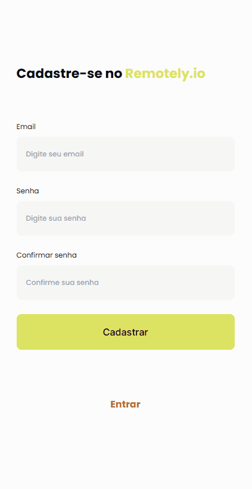
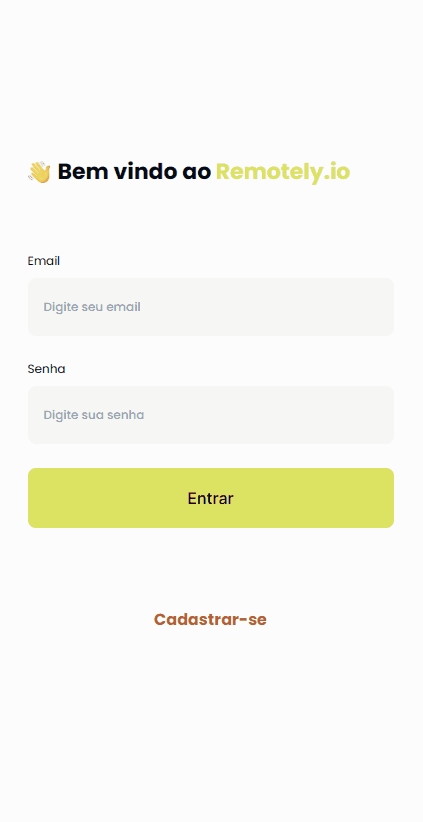
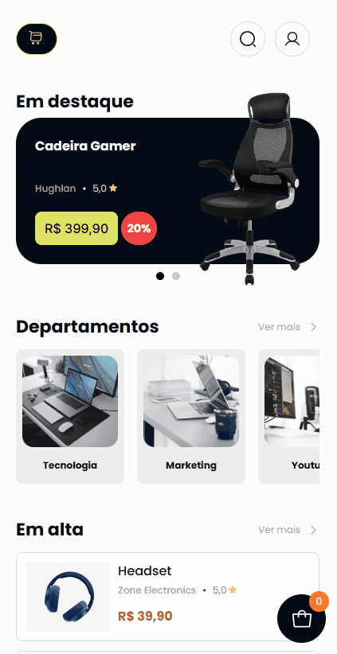

<h1>📖 Documentação Front-end</h1>

Este front-end foi desenvolvido, principalmente, com Typescript, React e Next.

 

<h2>🔗 Relacionados</h2>
<ul>
<li><a href="https://github.com/dhomini-rabelo/remotely-store">Introdução</a></li>
<li><a href="https://github.com/dhomini-rabelo/remotely-store/tree/main/backend">Documentação Back-end</a></li>
</ul>

 
<h2>🔗 Tópicos</h2>
<ul>
<li><a href="#organization">Organização</a></li>
<li><a href="#tools">Ferramentas</a></li>
<li><a href="#auth">Autenticação</a></li>
<li><a href="#contexts">Contextos</a></li>
<li><a href="#hooks">Hooks</a></li>
<li><a href="#routes">Rotas</a></li>
<li><a href="#tests">Testes</a></li>
</ul>

 
<h2 id="organization">🎯 Organização</h2>

<ul>

<li>remotely-store/frontend/ - Tudo relacionado ao front-end</li>
<li>remotely-store/frontend/app/ - Código do fonte do projeto Next</li>
<li>remotely-store/frontend/ - Além da pasta app/, fica o disponível para documentação, testes específicos e outras coisas relacionadas ao front-end</li>
<li>remotely-store/frontend/app/assets - Armazena arquivos estáticos</li>
<li>remotely-store/frontend/app/code - Contém código relacionado com a lógica do projeto, além de configurações e estrutura dos Models</li>
<li>remotely-store/frontend/app/layout - Contém código relacionado com a parte visualização e renderização do projeto</li>
<li>remotely-store/frontend/app/pages - Páginas do site, além de funcionalidades e componentes que as mesmas necessitam</li>

</ul>

<h3>Páginas no projeto</h3>

Os arquivos que que atuam como páginas web neste projeto terminam em page.tsx, o que permite aproximar
determinados arquivos relacionados somente com aquela página.

<h3>Componentes dentro de componentes</h3>

Quando temos componentes dentro de um componente que está dentro uma pasta /components/ ele fica numa pasta
chamada /subcomponents/ e vice-versa, para facilitar as importações e melhorar a estrutura.

<h3>Sessões</h3>

Componentes que se ocupam o mesmo espaço no mesmo contexto, ficam dentro de pastas /sessions/.

 
<h2 id="tools">🛠️ Ferramentas</h2>

<ul>
<li>Next => Framework principal do projeto, encima da biblioteca React</li>
<li>Tailwind => Estilizações rápida e produtiva</li>
<li>headlessui => Componentes úteis escritos com Tailwind</li>
<li>Styled-components => Estilizações mais específicas e variações de estilo para componentes</li>
<li>Phosphor-react => para ícones</li>
<li>keen-slider => para slides</li>
<li>use-context-selector => melhor performance para hook useContext</li>
<li>react-hook-form => controle de formulário, como eventos, campos, etc.</li>
<li>zod => validação de formulário</li>
<li>axios => cliente para consumir ratas do backend</li>
<li>date-fns => manipulação de datas</li>
<li>cookies-next => manipulação de cookies no cliente e no servidor</li>
<li>jotai => Compartilhamento de estado entre componentes de maneira simplificada</li>
<li>Eslint => formatação e linting</li>
<li>jest => testes</li>
</ul>

 
<h2 id="auth">🗝️ Autenticação</h2>

Este projeto utiliza um módulo personalizado para autenticação JWT, seguindo os princípios SOLID, em remotely-store/frontend/app/src/code/
modules/Auth. Onde temos uma classe para armazenar, verificar, obter e deletar as "instâncias" de autenticação,
e outra classe para configurar um cliente axios.

 
<h2 id="contexts">🪢 Contextos</h2>

<h3>Autenticação</h3>

Faz login, logout, carrega dados do usuário dentro de uma página, e também utiliza o módulo de autenticação
para lidar com token e configurar cliente.

<h3>Carrinho</h3>

Faz o controle dos produtos e de suas quantidades que estão no carrinho, além de salvar estes dados no localStorage.

 
<h2 id="hooks">🪝 Hooks</h2>

<h3>useFeedback</h3>

Usado para exibir mensagens de sucesso e erro em todo o sistema, utilizando o componente modal do headlessui.

 
<h2 id="routes">🌐 Rotas</h2>

<h3>• Cadastro</h3>

Realiza a validação do formulário usando zod no react-hook-form
 

 

<h3>• Login</h3>

 

<h3>• Home page</h3>

 

<h3>- Buscar</h3>

 

<h3>- Listagem de produtos a partir do departamento</h3>

 

<h3>- Página de produto</h3>

 

<h3>- Carrinho</h3>

 

<h3>• Minha conta</h3>

 

<h3>-> Telas no computador</h3>

 

